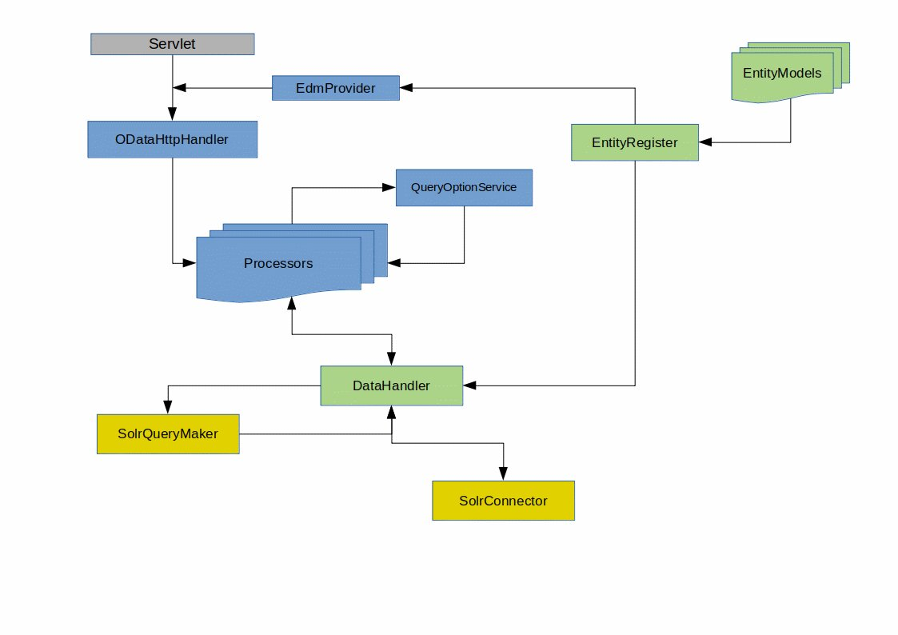

### Build WAR File
Build a war file form manual deployment with `./buildService.sh` the result is in the target
folder.

### Build Docker image
Create an image with tomcat and OData webservice with

`docker image build --tag docker-registry.rz.uni-bamberg.de/itfl-service/hydra/odata:latest .`

or uncomment the build section in `docker-compose.yml` and use `docker-compose build`
instead.

### Start Tomcat
Start a tomcat server with port 8080 mapped to the
[host](http://localhost:8080)

`docker-compose up -d`

### Environment variable need to be added

The Solr Url must be added as an environment variable to start the api. The Url must point to the DSpace Solr instance.

**variable:** `SOLR_URL`

Example value:

**value:** `http://localhost:8080/solr/search`

### Adjustments regarding data model of dspace instance

Already existing Entitys (Publication, Project, Researcher, Orgunit) can be used as default.

Probably need to be changed for entitys (regarding your database model):

- `Resource_TYPE_FILTER` need to be changed, if you are using a different resource type filters at your dspace installation. You can find your Resource Type Filters in solr: `localhost:8080/solr/#/search/schema-browser?field=resourcetype_filter`
- For Entity **Publication**: `ID_CONVERTER_TYP` need to be changed to the handle you are using at your dspace instance for dspace items
- Metadata field names and mapping of names in all Entities regarding your database model   

All new Entities with metadata need to be definied in `src/main/java/entitys/` and added to `src/main/java/entitys/EntityRegister`.
Relations between those entities and ComplexProperties (which represents NestedObjects from DspaceCris) need to be registered in the `EntitiyRegister` as well. 

### Use OData API

Examples:

* Get all Projects
`http://localhost:8080/ODataService/ODataService.svc/Projects`

* Get all Researchers
`http://localhost:8080/ODataService/ODataService.svc/Researchers`

* Get all Publications
`http://localhost:8080/ODataService/ODataService.svc/Publications`

* Get all Orgunits
`http://localhost:8080/ODataService/ODataService.svc/Orgunits`

* Get Researcher with id 1
`http://localhost:8080/ODataService/ODataService.svc/Researchers(1)`

* Get Publication with id 7
`http://localhost:8080/ODataService/ODataService.svc/Publications(7)`

* Get all Publications of Orgunit with id 5
`http://localhost:8080/ODataService/ODataService.svc/Orgunits(5)/Publications`

* Get all Researchers of Orgunit with id 5
`http://localhost:8080/ODataService/ODataService.svc/Orgunits(5)/Researchers`

* Get all Publications of Researcher with id 5
`http://localhost:8080/ODataService/ODataService.svc/Researchers(5)/Publications`

* Get all Researchers of Orgunit and Orgunit data with id 5 in single JSON Object
`http://localhost:8070/ODataService/ODataService.svc/Orgunits(14)?$expand=Researchers`

* Filter Researcher Name with String 'Test'
`http://localhost:8080/ODataService/ODataService.svc/Researchers?$filter=contains(name,'Test')`

* Filter Publications of a Researcher with String 'Book'
`http://localhost:8080/ODataService/ODataService.svc/Researchers(5)/Publications?$filter=contains(type,'Book')`

### API Architecture
rough draft of the architecture:

### More informations and filter options of OData

please have a look at:

